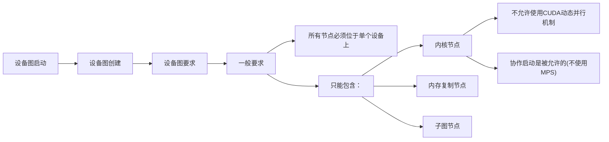

有许多工作流需要在运行时做出依赖于数据的决策，并根据这些决策执行不同的操作。用户可能更倾向于在设备上执行这一决策过程，
而不是将其卸载到主机（这可能需要从设备进行一次往返传输）。为此，CUDA提供了一种从设备启动图的机制。

设备图启动提供了一种便捷的方式，可从设备执行动态控制流，无论是简单的循环还是复杂的设备端工作调度器都适用。

从此，可从设备启动的图将被称为设备图，而不能从设备启动的图将被称为主机图。

设备图可以从主机和设备上启动，而主机图只能从主机上启动。与主机启动不同，如果在之前的图启动仍在运行时从设备上启动设备图，
将会导致错误，并返回```cudaErrorInvalidValue```；因此，设备图不能同时从设备上启动两次。同时从主机和设备上启动设备图将导致未定义行为。

## 1. 设备图的创建

为了从设备启动图，必须显式地为设备启动实例化该图。这可以通过向```cudaGraphInstantiate()```调用传递```cudaGraphInstantiateFlagDeviceLaunch```
标志来实现。与主机图的情况一样，设备图的结构在实例化时固定，不重新实例化就无法更新，且实例化只能在主机上执行。要使图能够为设备启动而实例化，它必须满足各种要求。

### 1.1 设备图要求

一般要求：

+ 图的所有节点必须位于单个设备上

+ 该图只能包含内核节点、内存复制节点、内存设置节点和子图节点

内核节点：

+ 图中内核不允许使用CUDA动态并行机制

+ 只要不使用MPS，协作启动是被允许的

**3. 内存复制节点**

+ 仅允许涉及设备内存和/或固定的设备映射主机内存的复制操作

+ 不允许涉及CUDA数组的复制

+ 两个操作数在实例化时都必须可从当前设备访问。请注意，复制操作将从图所在的设备执行，即使其目标是另一设备上的内存

### 1.2 设备图上传

要在设备上启动图形，必须先将其上传到设备，以填充必要的设备资源。这可以通过两种方式之一实现。

首先，图可以显式上传，既可以通过```cudaGraphUpload()```，也可以在通过```cudaGraphInstantiateWithParams()```实例化时请求上传。

或者，也可以先从主机启动该图，主机将在启动过程中隐式执行此上传步骤。

### 1.3 设备图更新

设备图只能从主机更新，并且在可执行图更新后必须重新上传到设备，更改才能生效。与主机图不同，在应用更新时从设备启动设备图将导致未定义的行为。

## 2. 设备启动

设备图既可以从主机也可以从设备通过```cudaGraphLaunch()```启动，该函数在设备上的签名与在主机上相同。设备图通过主机和设备上的相同句柄启动。
从设备启动设备图时，必须从另一个图中启动。

设备端图启动是按线程进行的，不同线程可能同时发起多个启动，因此用户需要选择一个单独的线程来启动特定的图。

与主机启动不同，设备图不能启动到常规的CUDA流中，而只能启动到不同的命名流中，每个命名流都表示一种特定的启动模式。下表列出了可用的启动模式。

### 2.1 即发即弃发射

顾名思义，“即发即弃”式启动会立即提交至GPU，并且独立于启动图运行。在“即发即弃”的场景中，启动图是父图，而被启动的图是子图。

在执行过程中，一个图最多可以有120个总计的“即发即弃”图。同一父图每次启动时，这个总数都会重置。

#### 2.1.1 图执行环境

为了充分理解设备端同步模型，首先需要理解执行环境的概念。

当从设备启动一个图时，它会被启动到自己的执行环境中。特定图的执行环境封装了该图中的所有工作以及所有生成的即发即弃工作。当图完成执行且所有生成的子工作都完成时，该图可被视为已完成。

### 2.2 尾部启动

与主机上不同，无法通过诸如```cudaDeviceSynchronize()```或```cudaStreamSynchronize()```等传统方法与GPU上的设备图进行同步。相反，为了支持串行工作依赖，
提供了一种不同的启动模式——尾部启动，以提供类似的功能。

当一个图的环境被视为完成时（即该图及其所有子图都完成时），尾启动就会执行。当一个图完成后，尾启动列表中下一个图的环境将取代已完成的环境，成为父环境的子环境。
与“即发即弃”启动类似，一个图可以有多个图排队等待尾启动。

#### 2.2.1 尾部自自动

设备图可以将自身加入尾部启动的队列，不过一个特定的图在同一时间只能有一个自启动请求处于排队状态。为了查询当前运行的设备图以便重新启动它，我们添加了一个新的设备端函数：

```
cudaGraphExec_t cudaGetCurrentGraphExec();
```

如果当前运行的图是设备图，此函数会返回其句柄。如果当前执行的内核不是设备图中的节点，此函数将返回NULL。

### 2.3 同级启动

同级启动是“即发即弃”启动的一种变体，在这种启动方式中，图不是作为启动图执行环境的子级启动，而是作为启动图父环境的子级启动。同级启动相当于从启动图的父环境进行“即发即弃”启动。

由于同级启动不会被启动到启动图的执行环境中，因此它们不会控制由启动图入队的尾部启动。

