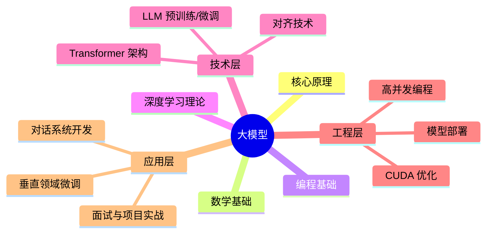

```mermaid
mindmap
  root((大模型))
      核心原理
      数学基础
      编程基础
      深度学习理论
    技术层
      Transformer 架构
      LLM 预训练/微调
      对齐技术
    工程层
      模型部署
      CUDA 优化
      高并发编程
    应用层
      对话系统开发
      垂直领域微调
      面试与项目实战
```
